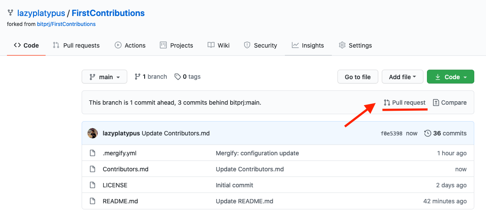
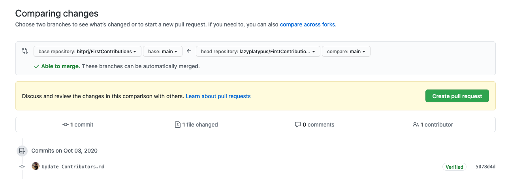

# Make your first open source contribution
🚀✨ Learn how to open source projects


#### If you don't have git on your machine, [install it](https://help.github.com/articles/set-up-git/).

## Fork this repository

Fork this repository by clicking on the fork button on the top of this page.
This will create a copy of this repository in your account.

## Clone the repository


Now clone the forked repository to your machine. Go to your GitHub account, open the forked repository, click on the code button and then click the _copy to clipboard_ icon.

Open a terminal and run the following git command:

```
git clone "url you just copied"
```

where "url you just copied" (without the quotation marks) is the url to this repository (your fork of this project). See the previous steps to obtain the url.


For example:

```
git clone https://github.com/this-is-you/firstcontributions.git
```

where `this-is-you` is your GitHub username. Here you're copying the contents of the firstcontributions repository on GitHub to your computer.

## Create a branch

Change to the repository directory on your computer (if you are not already there):

```
cd FirstContributions
```

Now create a branch using the `git checkout` command:

```
git checkout -b your-new-branch-name
```

For example:

```
git checkout -b add-daniel-kim
```

(The name of the branch does not need to have the word _add_ in it, but it's a reasonable thing to include because the purpose of this branch is to add your name to a list.)

## Make necessary changes and commit those changes

Now open `Contributors.md` file in a text editor, add your name to it. Don't add it at the beginning or end of the file. Put it anywhere in between. Now, save the file.


If you go to the project directory and execute the command `git status`, you'll see there are changes.

Add those changes to the branch you just created using the `git add` command:

```
git add Contributors.md
```

Now commit those changes using the `git commit` command:

```
git commit -m "Add <your-name> to Contributors list"
```

replacing `<your-name>` with your name.

## Push changes to GitHub

Push your changes using the command `git push`:

```
git push origin <add-your-branch-name>
```

replacing `<add-your-branch-name>` with the name of the branch you created earlier.

## Submit your changes for review

If you go to your repository on GitHub, you'll see a `Compare & pull request` button. Click on that button.



Now submit the pull request.



Soon I'll be merging all your changes into the master branch of this project. You will get a notification email once the changes have been merged.

## Keeping Your Fork Up to Date with the Original Repository

After you fork this repository, the original project may receive new updates. To keep your fork updated with those changes, follow these steps:

### Option 1: Sync Using GitHub (Without Command Line)

1. Go to your forked repository on GitHub.
2. Click on the **"Sync fork"** button (if available).
3. Click **"Update branch"** to pull the latest changes from the original repository.

### Option 2: Sync Using the Compare Feature

1. Go to your forked repository on GitHub.
2. Click on **"Compare"**.
3. Make sure:
   - **Base repository** = Original repository  
   - **Head repository** = Your fork  
4. Create a Pull Request from the original repo to your fork.
5. Merge that Pull Request into your fork to update it.

> ⚠️ Note: Sometimes the base and head repositories appear **reversed** in the Compare dropdown by default. Always make sure the **original repository is the base** and **your fork is the head** before creating the Pull Request.

This helps you keep your fork up to date with the latest changes so you can continue contributing without conflicts.

